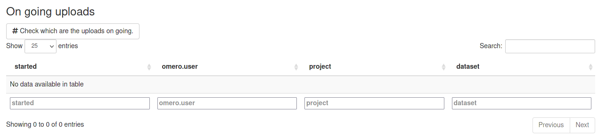
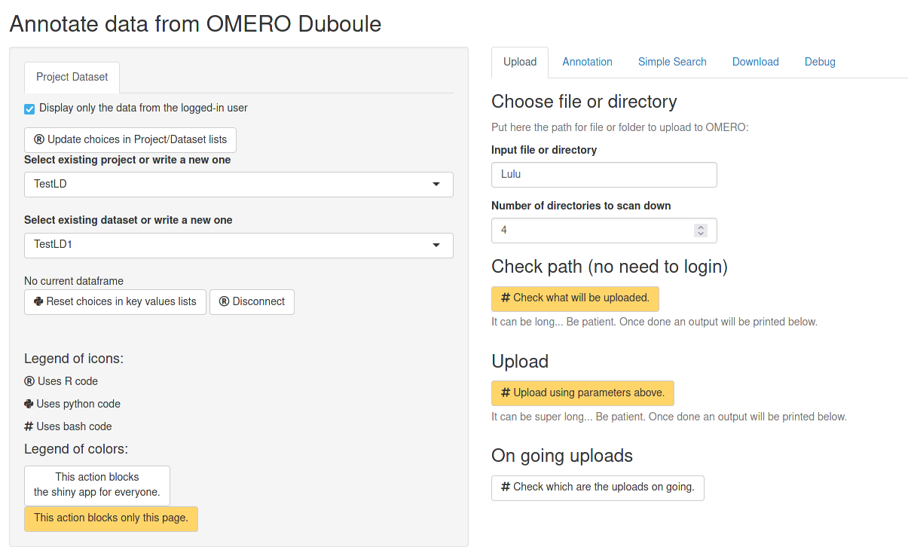
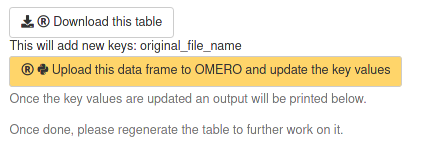

# omeroDubouleUploadAnnotate

Here is the code for the Shiny app hosted at [https://shinyduboule.epfl.ch/apps/omeroDubouleUploadAnnotate/](https://shinyduboule.epfl.ch/apps/omeroDubouleUploadAnnotate/) (only available through EPFL intranet) to upload and annotate data on OMERO.

## Table of content

- [Goal](#goal-of-the-shiny-app)
- [Usage](#usage)
  - [Audience](#audience)
  - [Interface presentation before login](#interface-presentation-before-login)
    - [Debug tab](#debug-tab)
    - [Upload tab (without login)](#upload-tab-without-login)
  - [Login](#login)
  - [Interface presentation after login](#interface-presentation-after-login)
    - [Project Dataset tab](#project-dataset-tab)
    - [Upload tab (with login)](#upload-tab-with-login)
    - [Annotation tab](#annotation-tab)
    - [Simple Search tab](#simple-search-tab)
    - [Downlaod tab](#download-tab)
- [Bugs / Enhancement ideas](#bugs-enhancement-ideas)

## Goal of the Shiny app

The shiny app was designed to faciliate the annotations of images on omero with key values and to ensure the tracability of images uploaded on omero.

## Usage

This documentation was written 2022-01-27 and some things may have changed since then.

### Audience

For the moment, the target audience of the shinyapp is Duboule's lab members. However, in practical anyone with an account on omero.epfl.ch can use it.

### Interface presentation before login

When the user go to the url. Here is the first page:

On the left there is a layout with a Login tab where you can log in with your gaspar credentials to access more functionalities. Below there is the legend for icons and button color.

On the right there is the main layout with only 2 tabs: Upload and Debug.

#### Debug tab

The Debug tab is useful in 2 cases:

- you want to know the current state of your session.
- you want to know which are the key values used in the group.
- you found a bug and you would like that I am able to fix it so you need to click on the tick box on the left of "Print to the standard out" before reproducing the actions which highlight the bug. (Don't forget to notify me by email or slack so I can watch).

#### Upload tab (without login)

The Upload tab without login gives access to only a small part. It allows to check that the folder/file you want to upload is valid. To do so:

- put in the box "Input file or directory" the path you want to use for upload. The path should be the same as the one on the s3 bucket without the bucket name.
- If your images are within subdirectories of subdirectories of subdirectories... mind that you increased the "Number of directories to scan down" at least to the required number.
- Finally click on the yellow button "Check what will be uploaded".

Now you need to wait because this is super long especially if you put the good one and you have a lot of images... As this button is yellow, hopefully, it does not block all sessions so if you want to do something else you can start a new one by opening the page in a new tab or a new window of your browser.

If you use a path which does not exists, you will have in few seconds something like this:

If you use a valid path but there is no picture file or you put a too low "Number of directories to scan down". It is quite long and at the end you have something like this:

Finally if you put a valid path with an appropriate depth you get something like this:

### Login

To login, you need to enter your username and password and then click on the "LOG IN" button (Enter key does not work).

You may not have noticed that below the "LOG IN" button, before you click it is written "You are not logged in.". If you forgot to click on the "LOG IN" button. It will still be written that. However, if you made a typo in your login or your password you will get: "Logged in failed."

If you succeed, the message below become grey and then, in few seconds, the Login tab disappear and a new tab "Project Dataset" appear.

### Interface presentation after login

Once you're logged in, the tab on the left changed from Login to "Project Dataset" and on the right you have now 5 tabs: Upload, Annotation, Simple Search, Download, and Debug.

#### Project Dataset tab

In this tab you get both info, choices and buttons.

- First, you have a check box to decide to work only on your projects or also on projects from other users you have access. By default, the check box is ticked indicating that you will only see your data.
- Then, you have a button "Update choices in Project/Dataset lists". This is useful if you created a new Project or a new Dataset on omero with another session of the Shiny app or with the omero web interface or with omero insight.
- Then, you have a List with all existing projects and then a list with all existing Datasets within the selected Project. If you want to write a new Project name or Dataset name, click on the selected one and then erase with backspace.
- Below, you have a text indicating info about your last upload in this session or the dataframe with annotations you are working on.
- Then, you have 2 buttons,
  - one is "Reset choices in key values lists" which is usefull if you updated some key values with another session or in the web interface and you want to inform the Shiny app. Or on the contrary you removed some key values and you want to prevent the Shiny app to propose you these key values.
  - the other is Disconnect. When you finished working on this Shiny app, it would be great to click on this button before closing the window but it is not mandatory.

#### Upload tab (with login)

The upper part corresponds exactly to what is described [above](#upload-tab-without-login).

If you did not fill the "Input file or directory", you only have a new button "Check which are the uploads on going" which allows you to monitor on going uploads which where launched with a previous session from you or from another user of the Shiny app. For example:

This will not be updated automatically. You need to click on the button each time you want to know the status. When there is no on going uploads, you get:

If you fill the "Input file or directory", you see a new section appearing: Upload with a new button: Upload using parameters above.

If you want to upload images to omero this is where you need to click but before carefully check the selected project, dataset and input file or directory.

Now you need to wait because this is super long especially if you have a lot of images... As this button is yellow, hopefully, it does not block all sessions so if you want to do something else you can start a new one by opening the page in a new tab or a new window of your browser. Especially, you can open a new tab to check that you have an on going upload.

Of note, if the path you provided does not exists you will not see any error message.

When it is finished you will get a message like:

And at the bottom of the Project Dataset tab you will have a message like: "Last upload is Alex/test/ in TestLD/TestLD3".
However, if you have a lot of images, you can also decide to close the browser page and the upload will continue.

#### Annotation tab

This is the most useful tab but also the more complex.

The first choice is the level at which you are working: either all your projects, or all the datasets of a selected project or a single dataset.

Then you need to get all the key values for the images you chose from omero. This is done with "Generate the dataframe from existing key values".

This will fill 2 tables: the 'on going table' and the 'table to upload to OMERO'.

My idea was that you first add key values to the 'on going table' that may contain only some of the images of the 'table to upload to OMERO'. When you are happy with this 'on going table' you will 'merge' it into the 'table to upload to OMERO' and thus you can select new images in your 'on going table' etc.

At the end, when you are happy with your 'table to upload to OMERO' you really upload this table to OMERO as csv attached to dataset(s) and in parallel you update the key values of each image on omero.

If I come back to the description of this tab, after having generated the table, I can add info from upload. This is only possible when the level chosen is "All images of the selected dataset" which is the default level.

If you uploaded on this session, you have a message at the bottom of the "Project Dataset" tab like "Last upload is ...". If you chose the same dataset and you generated the tables you have another message the line below which is "The current dataframe corresponds to ...".
In this case, in Info from upload you have a button "Add info from upload". This will allow to add the path of the file which has been used to generate the images in omero in the column 'original_file' of the bottom dataframe which means adding a new key original_file and new values fitting the file which has been used.

Most of the time you did not upload in the same session but the same info has been uploaded to omero into a log file. The Shiny app propose you to parse this log file to add the column 'original_file' the same way, in the bottom table. If there was multiple upload to the same dataset, there will be multiple log files. You need to click on 'Add info from this upload' for each log file corresponding to the different uploads.

Another 'automatic' key value you can add is the acquisition date and time. To add these key values, just click on 'Add info from acquisition date'.

Now comes the manual annotations with personal key values.

First you need to choose which are the images to which you want to add or update the key values (Select images to add annotations).
If you want 'All images', this is easy. If you want 'Only some images', two new boxes appear. The way to select the images will be by finding characters which are specific to your images in any column of the bottom table. First select the column of the bottom table which you will use to make your selection. This column needs to be in the 'Table to upload to OMERO' but may not be in the 'On going table'. The 'On going table' is minimal to highlight the new key values. Then type some characters in the next box and the 'On going table' will be updated with the images which match the pattern. See the example:

Note: This part uses the [grep](https://stat.ethz.ch/R-manual/R-devel/library/base/html/grep.html) function from R. Thus you can use complex patterns like "LD[1-2]|LD4".

Once you managed to select the images you wanted to attribute new key values.
- Select the key. You can choose from existing key values but you can also create a new one.
- Select the value.
  - Either you want the "Same value for all". Then you can choose among the existing values for this key or create a new one.
  - Or you want to extract the value from a column of the 'Table to upload to OMERO'. In this case, you need to choose the column where the info is, then select which character will be used to split the value and finally which position you want to extract. You can do multiple trial as each time the new value will replace the old one.
  See the example:

  

  Note: This uses the function [strsplit](https://stat.ethz.ch/R-manual/R-devel/library/base/html/strsplit.html) from R. Some characters need to be 'protected' like the '.' in this example which needs to be replaced by '\.'.

Once you have filled your 'On going Table', you have below 2 buttons. 'Reset on-going table': if you use a wrong key and you want to restart building your 'On going Table'. 'Merge with the existing key values': when you want to put this info in the 'Table to upload to OMERO'.

You then have the possibility to remove a column from the 'table to upload to OMERO' which means remove a key. This allow both to remove a key you were planning to upload to OMERO but you changed your mind and to remove a key which is on OMERO that you put previously and changed your mind.

Below you have the 'table to upload to OMERO' with potentially new key values and less key values compared to what is on OMERO depending what you did above.

You have a button to Download this table (as csv).

You have a message which indicates which would be the changes if you upload. For example, with the example above:

Below you have the yellow button to upload to OMERO the table and update the keu values.

If you plan to remove an existing key, then the message is different. For example if I want to remove the key Well:

Then the message is:

You can choose either to put back the Well key in the 'table to upload to OMERO' with the left button or to confirm you choice to remove this 'Well' key. You will see that you can change your mind before uploading.

Once clicked on the yellow button, a python script will update the key values of all images when needed. Now you may need to wait if you have a lot of images... As this button is yellow, hopefully, it does not block all sessions so if you want to do something else you can start a new one by opening the page in a new tab or a new window of your browser.

At the end you get a message (you may need to scroll down to see it).

#### Simple Search tab

This tab is quite simple, you need to select first the number of key values you want to use, then select each of them. Finally, click on Search.

For the moment, you cannot use multiple values for the same key nor a range.

If you want to do complex search I encourage you to use the Download tab:

#### Downlaod tab

For the moment, this tab contains a single button which allows you to get all your images with all your key values. If you also want to get the images of your colleagues, uncheck the tick box in the "Project Dataset" tab on the left and click on Download.

## Bugs / Enhancement ideas

Do not hesitate to write issues with any but or idea for enhancement. Alternatively you can send me an email but I prefer Issues from github.
